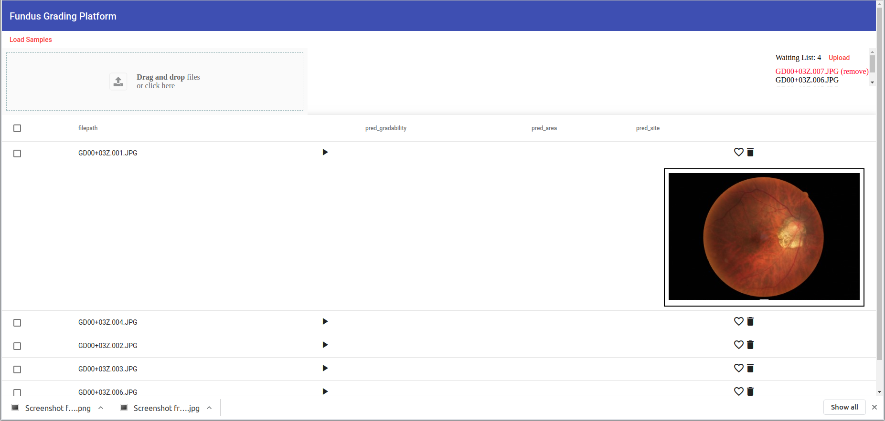

# Fundus Grading Platform

This is an product-ready application for grading fundus photos using Angular and Flask. Deep learning models were trained with MobileNet and DenseNet in Keras and compressed with Tensorflow Lite.

The application aims for a desktop use or data server use to avoid cloud computation cost. It therefore heavily used the file system by the Flask backend. For using uploaded images, it will be stored under <b>localStorage</b> with a client-side image compressing, errors may occur if you exceeds the quota, which is diversed from browser to browser. For using backend CSVs, it will send the full-sized images without any preprocessing.

Sample Images can be found from [EyePACS dataset](https://www.kaggle.com/c/diabetic-retinopathy-detection).

## Project Structure.

- app
    - frontend -- The Angular frontend.
    - fundus_sample -- The sample images for lazy users to have a quick test.
    - models -- Pre-trained and compressed Tensorflow Lite models.
    - index.py -- Python Flask backend.


## Requirements.
- For Python:
    Note: Tensorflow has to be 1.14 above. It is recommended to use 2.0 as it is the development environment.
    ```bash
    $ pip install -r requirements.txt
    ```
- For Node:
    ```bash
    $ cd frontend
    $ npm install
    ```
Note: <b>If using self-provided fundus photos, you must provide a .csv file with a column named 'filepath'.</b>

## Remark
Can't run on some CPUs since it is not supported for Tensorflow AVX instructions.


## Deployment
To access from the outside, please update the ip address accordingly in ```/frontend/src/environments/environment.ts```.

Then build docker image with
```bash
$ sudo docker build -t fundus-dl-app:0.1 .
```
This will take some time due to the ```apt-get update``` process. After that, you may start up the docker container:
```bash
$ sudo docker run -d -p 5000:5000 fundus-dl-app:0.1
```
*NOTE*: Has to be 5000 port for external, or the internal services cannot be accessed from the frontend.
For debugging purpose, we need to overwrite the ENTRYPOINT for the image, hence, you may run:
```bash
$ sudo docker run -d --entrypoint=/bin/bash fundus-dl-app:0.1
```

## Screenshot



